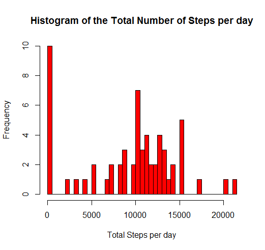
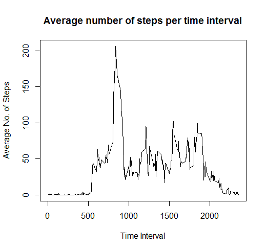
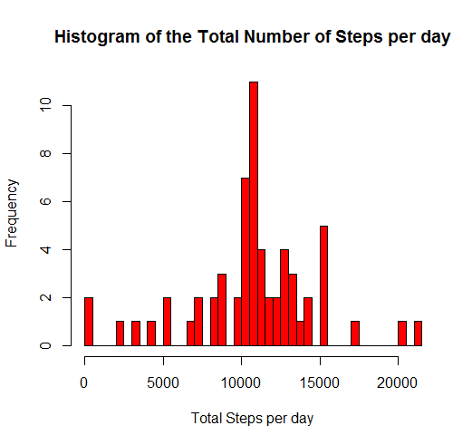
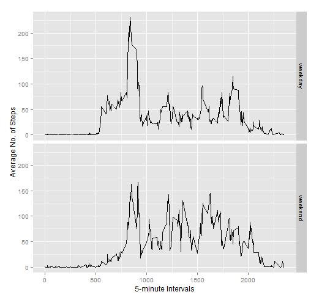

This is an R Markdown document. Markdown is a simple formatting syntax for authoring HTML, PDF, and MS Word documents. For more details on using R Markdown see <http://rmarkdown.rstudio.com>.

When you click the **Knit** button a document will be generated that includes both content as well as the output of any embedded R code chunks within the document. You can embed an R code chunk like this:

You can also embed plots, for example:

```{r, echo=FALSE}
plot(cars)
```


# Reproducible Research Course Project 1
### Required libraries
```{r}
library(lubridate)
library(dplyr)
library(chron)
library(ggplot2)
```
## Code for reading in the dataset and/or processing the data
```{r}
fulldata = read.csv("activity.csv",header = TRUE,sep = ",",na.strings = "NA")
fulldata = tbl_df(fulldata)
```
##### Changing the date variable to appropriate format
```{r}
fulldata$date = ymd(fulldata$date)
```
## Initial analysis of data
##### Calculating total number of steps taken each day
```{r}
sum_data = fulldata %>% 
  select(steps,date) %>% 
  group_by(date) %>% 
  summarize(totalsteps = sum(steps,na.rm=TRUE))
```
##### Histogram of the total number of steps taken each day
###### *X-label is the total no. of steps per day, Y-label is the no. of counts of those occurences* 
```{r}
hist(sum_data$totalsteps,
     xlab = "Total Steps per day",
     breaks = 50,col = "red",
     main = "Histogram of the Total Number of Steps per day")
```

##### Mean and median number of steps taken each day
```{r}
meanSteps = mean(sum_data$totalsteps,na.rm = TRUE)
medianSteps = median(sum_data$totalsteps,na.rm = TRUE)
```
Mean no. of steps is given by **9354** and median no. of steps is given by **10395**

##### Time series plot of the average number of steps taken
```{r}
avg_data = fulldata %>% 
  select(steps,interval) %>% 
  group_by(interval) %>% 
  summarize(avgsteps = mean(steps,na.rm=TRUE))

with(avg_data,
     plot(avgsteps~interval,
          type = "l",
          ylab = "Average No. of Steps",
          xlab = "Time Interval",
          main = "Average number of steps per time interval"))
```

##### The 5-minute interval that, on average, contains the maximum number of steps
```{r}
maxInterval = avg_data$interval[max(avg_data$avgsteps)]
```
Interval with the maximum average number of steps is given by **1705-1710**

## Imputing missing data
##### Calculating total no. of NAs in data set
```{r}
numNA = sum(is.na(fulldata$steps))
```
There are a total of **2304** missing values
##### To impute missing data, we will use the **mean** for the relavant 5min interval for the day through a custom function that assigns the correct value if a *NA* is seen
```{r}
newdata = fulldata
imputeData = function(x1,x2){
  if(is.na(x1)){
    x1 = avg_data[avg_data[,1] == x2,2]
  }
  else
    x1 = x1
}
t1 = as.vector(unlist(mapply(imputeData,newdata$steps,newdata$interval,SIMPLIFY = TRUE)))
```
##### Overwriting the original data with the new imputed data
```{r}
newdata$steps = t1
```
##### Calculating total number of steps taken each day
```{r}
sum_data_new = newdata %>% 
  select(steps,date) %>% 
  group_by(date) %>% 
  summarize(totalsteps = sum(steps))
```
##### Histogram of the total number of steps taken each day
```{r}
hist(sum_data_new$totalsteps,
     xlab = "Total Steps per day",
     breaks = 50,col = "red",
     main = "Histogram of the Total Number of Steps per day")
```

## Mean and median number of steps taken each day after imputing values
```{r}
meanStepsNew = mean(sum_data_new$totalsteps)
medianStepsNew = median(sum_data_new$totalsteps)
```
The new mean number of steps taken each day is now **10766** while the median number of steps is **10395**
The values for both mean and median have changed. Mean has changed more drastically than median.
In this instance, imputing values have raised the overall mean of the data set. This is largely due to an inherent skew in the data set.
By imputing mean values, we have increased the height of the histogram about the mean.
##### Creating factor variable for weekday/weekend
```{r}
newdata$weekday = is.weekend(newdata$date)
newdata$weekday = factor(ifelse(newdata$weekday,"weekend","weekday"))
```
##### Summarizing data across 5-minute interval and weekday/weekend
```{r}
sum_data_wk = newdata %>% 
  select(steps,interval,weekday) %>% 
  group_by(interval,weekday) %>% 
  summarize(meansteps = mean(steps))
```
## Panel plot comparing the average number of steps taken per 5-minute interval across weekdays and weekends
```{r}
ggplot(data = sum_data_wk, aes(x = interval,y = meansteps)) +
  geom_line() +
  facet_grid(weekday~.) + 
  xlab("5-minute Intervals") +
  ylab("Average No. of Steps")
```


It seems like for **weekdays**, there is much higher activity in the *earlier* part of the day. However, the *average* activity in the **afternoon** is lower as compared to the *weekends*.


